---
author:
  name: Никифоров Захар Сергеевич
  group: НКАбд-05-25
  student-id: 1032253520
title: "Отчет по лабораторной работе №2"
subtitle: "Архитектура компьютера"
license: "CC BY"
---

# **Цель работы**

Целью работы является изучение идеологии и применения средств контроля версий, приобретение практических навыков по работе с системой контроля версий git.

# **Порядок выполнения работы**
## **Базовая настройка git**
Делаем предварительную конфигурацию git, используя терминал, вводя в нем
следующие команды, указав свои данные, которые мы предварительно сделали перед этим пунктом:

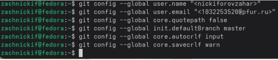{#fig-001 width=70%}

## **Создание SSH-ключа**

Для идентификации на сервере репозиториев создадим приватный и общий
ключ.

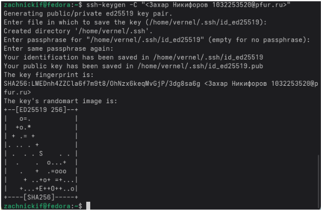{#fig-002}

Публичный ключ сгенерировали. Теперь скопируем его и вставим его на сайте github. Назову его «mykey».

{#fig-003}

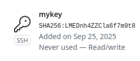{#fig-004}

## **Создание рабочего пространства и репозитория на основе шаблона курса**
Создадим каталог для нашего предмета.

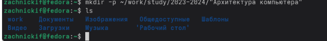{#fig-005}

## **Создание репозитория курса на основе шаблона**
После создания по шаблону переходим в каталог курса через терминал,
после чего копируем репозиторий.

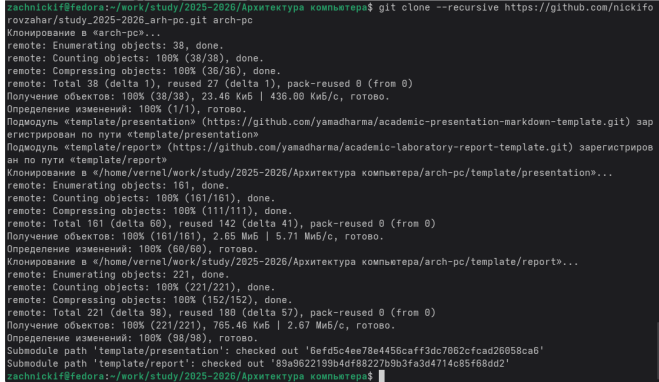{#fig-006}

Копирование прошло успешно.

## **Настройка каталога курса**

Перейдем в каталог «arch-pc» и пропишем некоторые команды.

{#fig-007}

Отправим файлы на сервер.

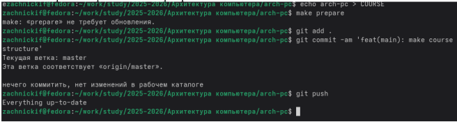{#fig-008}

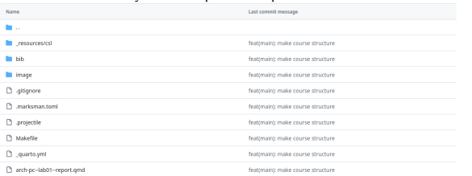{#fig-009}

Файлы были успешно загружены. Иерархия также была правильно создана

# Практические задания

Загрузим лабораторную №1 на github, предварительно добавив её в
соответствующий каталог «/lab1/report».

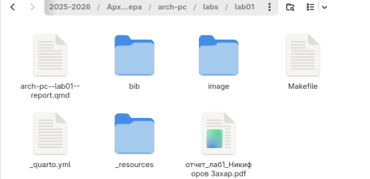{#fig-010}

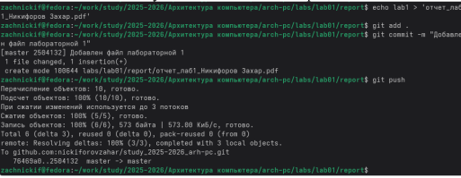{#fig-011}

Файл успешно добавлен. Проверим же на сайте наличие файла.

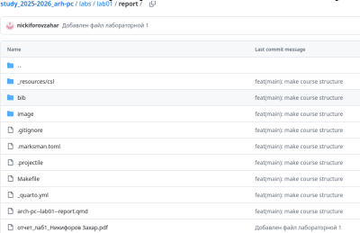{#fig-012}

Операция выполнена. Повторим всё то же для лабораторной №2.

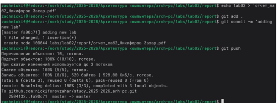{#fig-013}

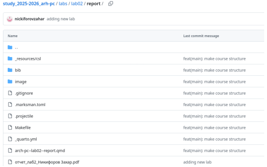{#fig-014}

Загрузка файлов была выполнена успешно.

# Выводы

В ходе лабораторной работы были успешно освоены основы работы с сис
темой контроля версий Git. Была выполнена базовая настройка окружения, генер
ация SSH-ключа для безопасного подключения к GitHub, а также создание и нас
тройка рабочего пространства курса. Приобретены практические навыки работы
с основными командами Git.

::: {#refs}
:::
