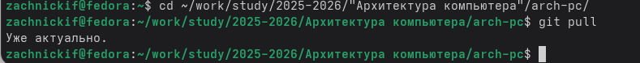
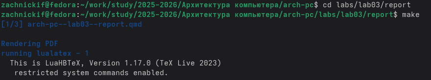
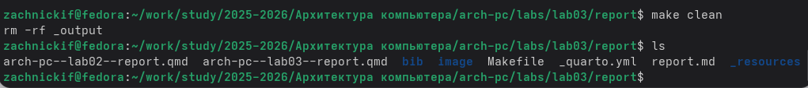
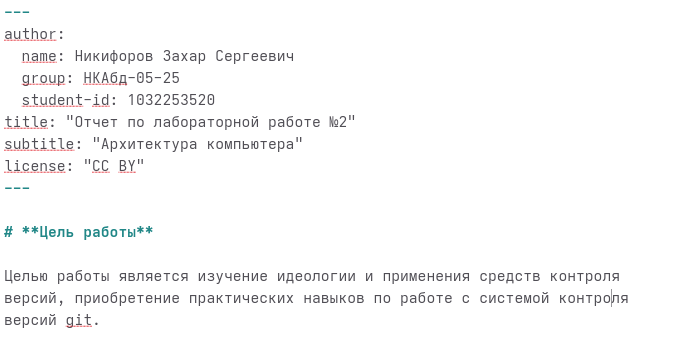

---
author:
  name: Никифоров Захар Сергеевич
  group: НКАбд-05-25
  student-id: 1032253520
title: "Отчет по лабораторной работе №2"
subtitle: "Архитектура компьютера"
license: "CC BY"
---

# **Цель работы**

Освоить процедуру оформления отчётов с использованием легковесного языка
разметки Markdown.

# **Порядок выполнения работы**
## **Обновление репозитория**

Переходим в каталог курса и обновляем репозиторий

{#fig-001 width=70%}

Обновление прошло успешно

## **Компиляция шаблона** 

Используем команду *make* и убеждаемся, что файлы были созданы

{#fig-002 width=70%}

Файл были созданы в каталоге _output

## **Удаление шаблона**

Пользуемся командой *make* *clean* и удаляем созданный каталог.

{#fig-003 width=70%}

Каталог был удален.

# **Практические задания**
## **Создание отчета по второй лабораторной**
Пользуясь языком *Markdown* оформляем отчет и компилируем его.

{#fig-004 width=70%}

{#fig-005 width=70%}

Компиляция прошла успешно. Теперь добавим это на гитхаб.

# Выводы

В ходе лабораторной работы были успешно освоены основы работы с сис
темой контроля версий Git. Была выполнена базовая настройка окружения, генер
ация SSH-ключа для безопасного подключения к GitHub, а также создание и нас
тройка рабочего пространства курса. Приобретены практические навыки работы
с основными командами Git.

::: {#refs}
:::
