---
author:
  name: Никифоров Захар Сергеевич
  group: НКАбд-05-25
  student-id: 1032253520
title: "Отчет по лабораторной работе №5"
subtitle: "Архитектура компьютера"
license: "CC BY"
---

# **Цель работы**

Приобретение практических навыков работы в Midnight Commander. Освоение инструкций языка ассемблера mov и int.

# **Порядок выполнения работы**
## **Midnight commander**

Открываем *Midnight commander*, вписав в консоли *mc*, переходим в каталог ~/work/arch-pc и создаем папку *lab05*.

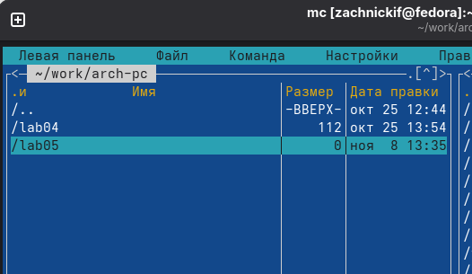{#fig-001 width=70%}

Создадим файл *lab5-1.asm*, пользуясь строкой ввода

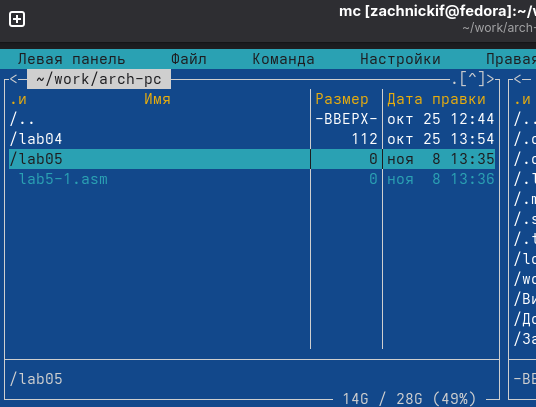{#fig-002 width=70%}

Откроем этот файл для редактирования с помощью функциональной клавиши *F4* и впишем программу из листинга 5.1, а потом сохраним с помощью *F2*.

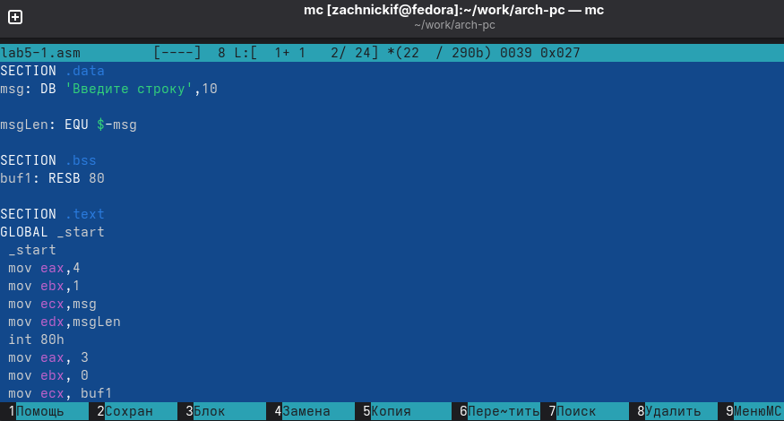{#fig-003 width=70%}

Убедившись, что текст сохранился корректно, создаем объектный файл и запускаем его.

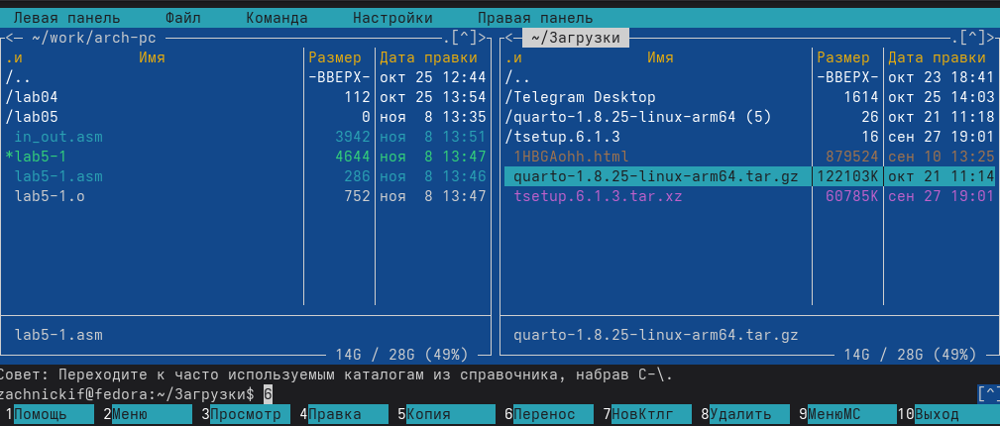{#fig-004 width=70%}

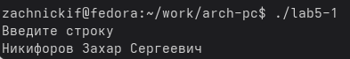{#fig-005 width=70%}

Программа скомпилировалась успешно, мы получили вывод-запрос текста и прием строки с клавиатуры. При получении строки, программа закрывается

##**Подключение внешнего файла in_out.asm**

Скачиваем файл с ТУИС и перемещаем его в каталог *lab05* из загрузок, используя интерфейс *Midnight commander*.

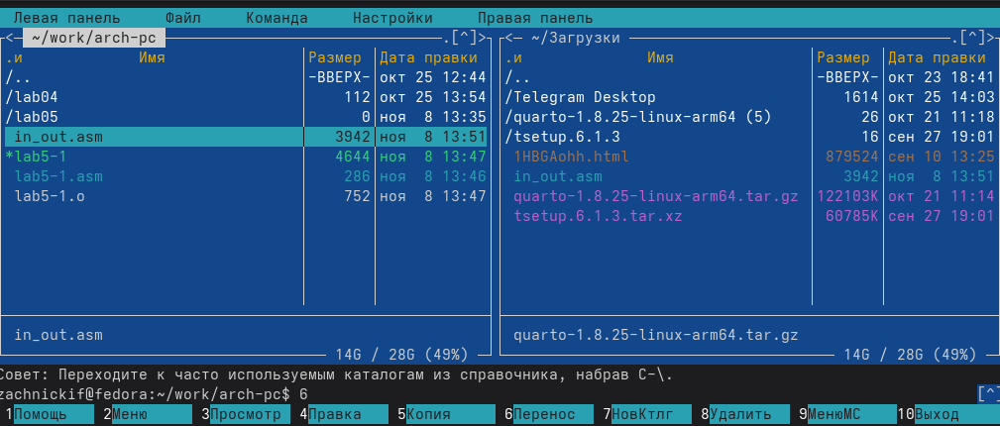{#fig-006 width=70%}

Далее делаем копию файла *lab5-1.asm*, называя ее *lab5-2.asm*

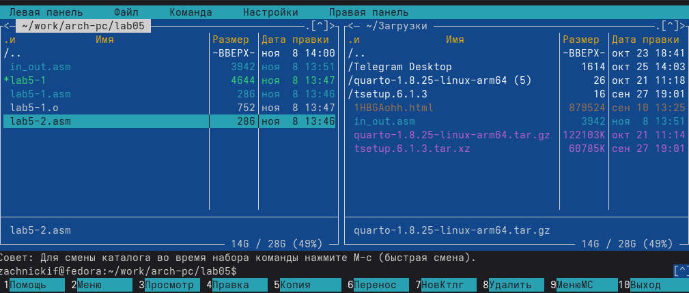{#fig-007 width=70%}

Редактируем содержание, импортируя и используя функции из скачанного файла, а потом запускаем файл.

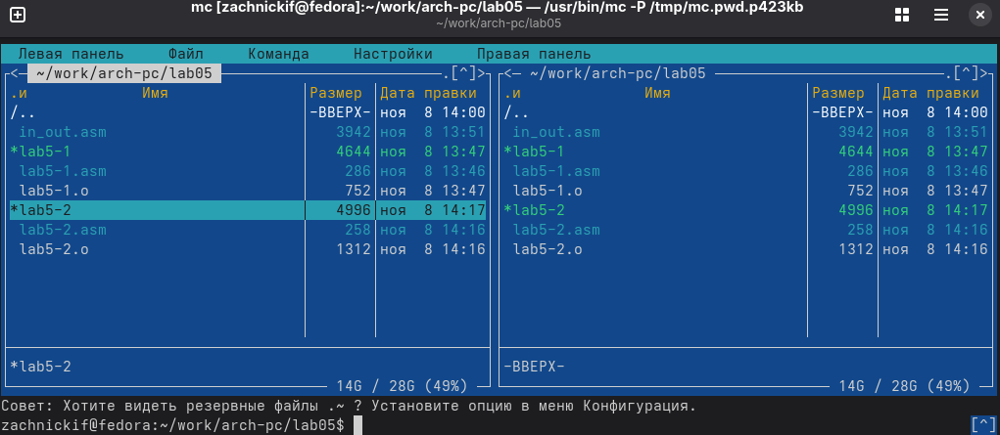{#fig-008 width=70%}

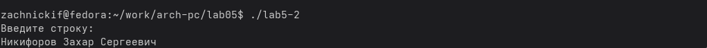{#fig-009 width=70%}

Программа успешно скомпилировалась и работает точно также, как и раньше, но теперь ее исходный код приятнее и короче.
Теперь заменим *sprintLF* на *sprint*:

{#fig-010 width=70%}

Результат отличается тем, что теперь нет перехода на новую строку.

# **Задание для самостоятельной работы**

Создаем копию файла *lab5-1.asm* и вносим в нее изменения, создав раздел о выводе строки из буфера.

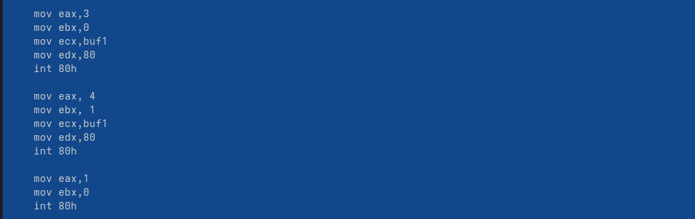{#fig-011 width=70%}

Собираем программу и проверяем правильность выполнения.

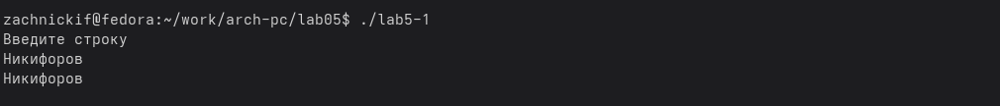{#fig-012 width=70%}

Вывод корректный, перейдем к следующему задание, где нужно использовать функции из скачанного файла. Теперь также создаем новый файл, но уже *lab5-2.asm* и редактируем его, добавив раздел с функцией вывода данных на следующей строке.

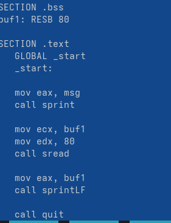{#fig-013 width=70%}

Собираем программу и проверяем на корректность работы.

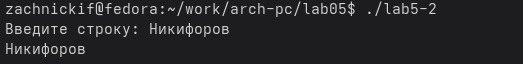{#fig-014 width=70%}

Программа работает правильно.

# **Выводы**

В ходе работы были приобретены практические навыки в *Midnight Commander* и освоены инструкции ассемблера *mov* и *int*

::: {#refs}
:::
