---
author:
  name: Никифоров Захар Сергеевич
  group: НКАбд-05-25
  student-id: 1032253520
title: "Отчет по лабораторной работе №5"
subtitle: "Архитектура компьютера"
license: "CC BY"
---

# **Цель работы**

Освоение арифметических инструкций языка ассемблера NASM.

# **Порядок выполнения работы**
## **Символьные и численные данные в NASM**

Создаем каталог *lab06*, а в нем создаем файл *lab6-1.asm*, записываем код из *Листинг 6.1* и компилируем его.

{#fig-001 width=70%}

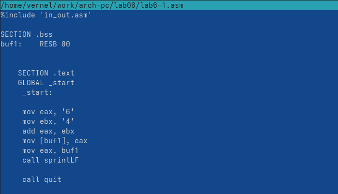{#fig-002 width=70%}

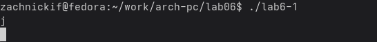{#fig-003 width=70%}

Получаем на вывод букву *j*. Это происходит потому, что код символа 6 равен '00110110' в двоичном представлении (или 54 в десятичном представлении), а код символа 4 – '00110100' (52). Команда *add eax, ebx* запишет в регистр eax сумму кодов – 01101010 (106), что в свою очередь является кодом символа j.

Далее изменим код программы, убрав кавычки вокруг цифр.

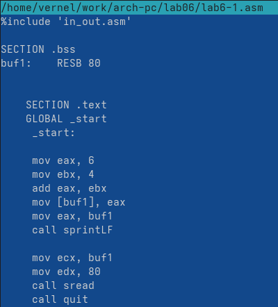{#fig-004 width=70%}

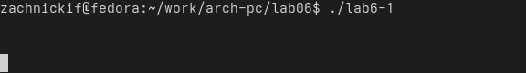{#fig-005 width=70%}

На выход мы получаем символ переноса строки, который имеет код 10.

{#fig-006 width=70%}

Символ не выражается в качестве *n* с обратной дробью, но видно перенос строки.

Теперь создадим новый файл *lab6-2.asm* запишем в него код из *Листинг 6.2* и скомпилируем его.

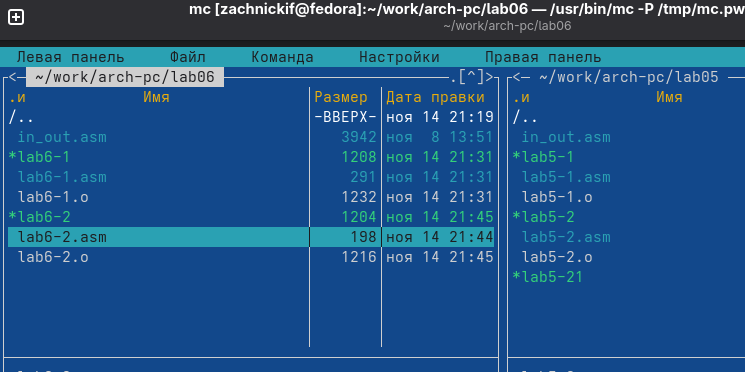{#fig-007 width=70%}

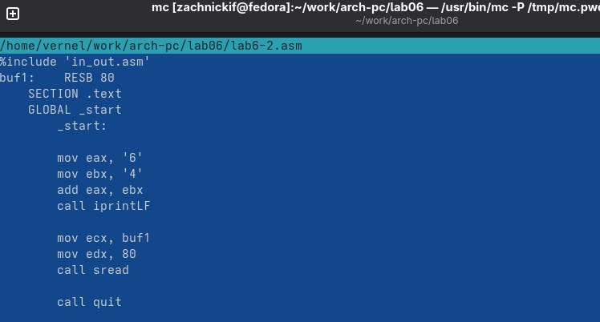{#fig-008 width=70%}

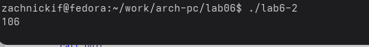{#fig-009 width=70%}

В результате работы программы мы получим число 106. В данном случае, как и в первом, команда add складывает коды символов ‘6’ и ‘4’ (54+52=106). Однако, в отличии от программы из *Листинг 6.1*, функция *iprintLF* позволяет вывести число, а не символ, кодом которого является это число.

Теперь внесем изменения, убрав кавычки и заменив *iprintLF* на *iprint*.

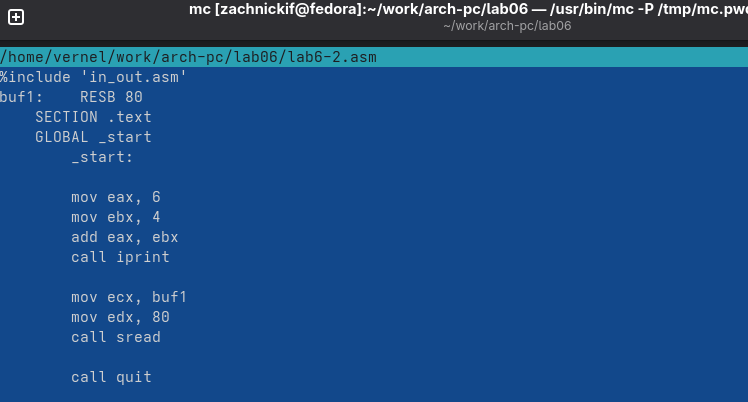{#fig-010 width=70%}

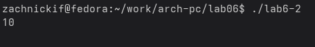{#fig-011 width=70%}

В результате работы программы мы получим число 10. Из отличий заметно отстутствие переноса строки.

## **Выполнение арифметических операций в NASM**

Создадим файл *lab6-3.asm*, запишем в него код из *Листинг 6.3* и скомпилируем его. 

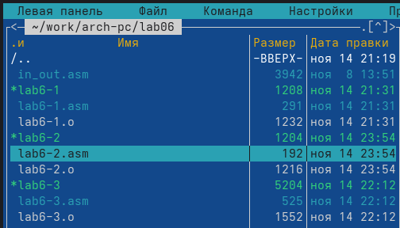{#fig-012 width=70%}

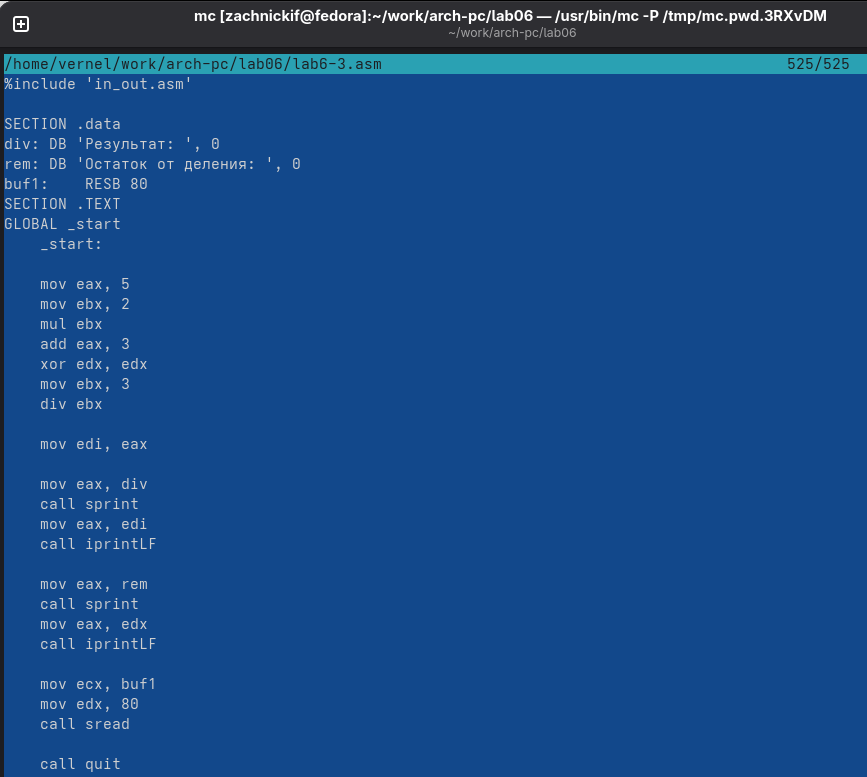{#fig-013 width=70%}

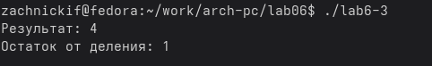{#fig-014 width=70%}

Результат такой, какой и должен быть. Теперь внесем изменения, изменив функцию на *f(x) = (46+2)/5* .

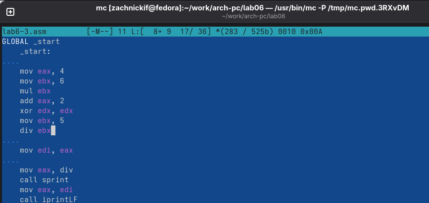{#fig-015 width=70%}

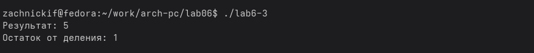{#fig-016 width=70%}

Результат изменился соответственно функции.

Теперь создадим файл *variant.asm*, запишем в него код из *Листинг 6.4* и скомпилируем.

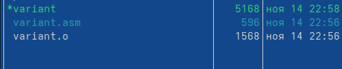{#fig-017 width=70%}

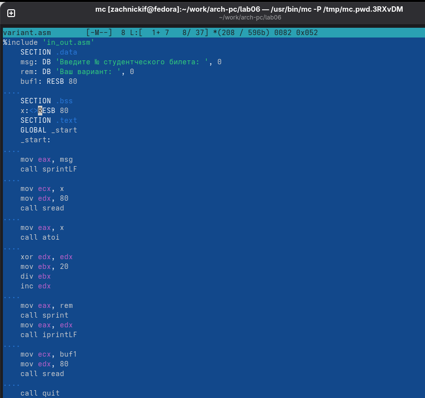{#fig-018 width=70%}

{#fig-019 width=70%}

В результате я получил 1. Это соответствует функции, так как мой номер студенческого билета кратен 20 и имеет остаток 0, а вариант 0 быть не может, поэтому программа превратила 0 в 1.

1. Следующие строки:

{#fig-020 width=70%}

2. Чтобы прочитать номер студенческого билета, как число.

3. Эта функция нужна, чтобы преобразовать строку в число.

4. Следующие строки:

{#fig-021 width=70%}

5. В *EDX*, причем всегда.

6. Эта инструкция нужна, чтобы увеличить остаток на 1. В нашем случае помогает начать счёт варианта с 1, а не 0.

7. Следующие строки:

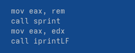{#fig-022 width=70%}

# **Задание для самостоятельной работы**

Создам файл *practice.asm* и, опираясь на прошлые, напишу следующий код, который будет вычислять функцию *f(x) = (10+2x)/3* из введенного x, согласно моему варианту:

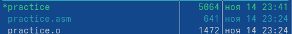{#fig-023 width=70%}

{#fig-024 width=70%}

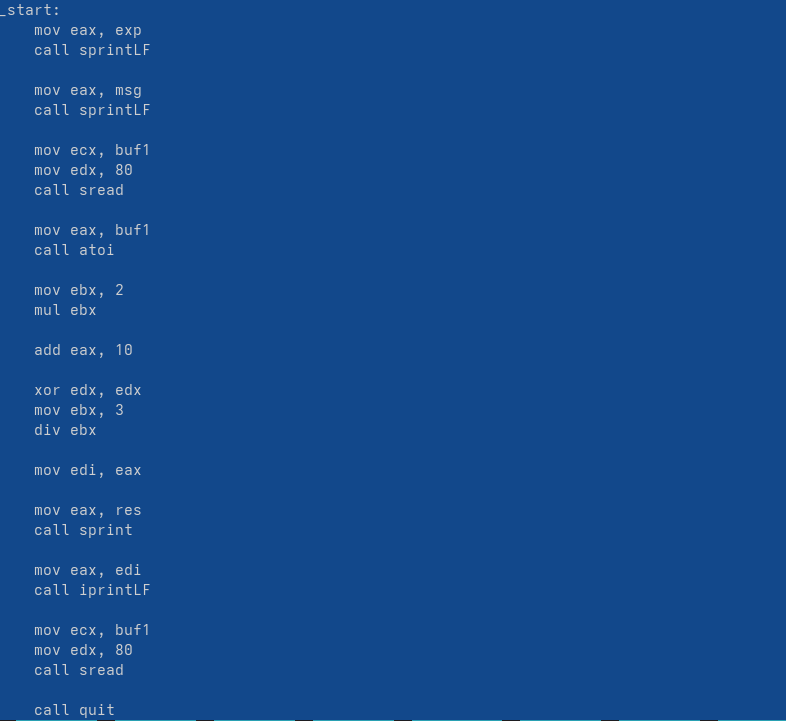{#fig-025 width=70%}

Использую значения x равные 1 и 10.

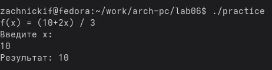{#fig-026 width=70%}

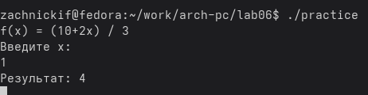{#fig-027 width=70%}

Программа работает корректно, проверив аналитически, я пришел к выводу, что и арифметически корректно тоже.
# **Выводы**

В ходе работы были освоены арифметические конструкции языка *nasm*.

::: {#refs}
:::
