---
author:
  name: Никифоров Захар Сергеевич
  group: НКАбд-05-25
  student-id: 1032253520
title: "Отчет по лабораторной работе №5"
subtitle: "Архитектура компьютера"
license: "CC BY"
---

# **Цель работы**

Изучение команд условного и безусловного переходов. Приобретение навыков написания
программ с использованием переходов. Знакомство с назначением и структурой файла
листинга.

# **Порядок выполнения работы**
## **Реализация переходов в NASM**

Создаем каталог *lab07*, а в нем создаем файл *lab07.asm*, записываем код из *Листинг 7.1* и компилируем его.

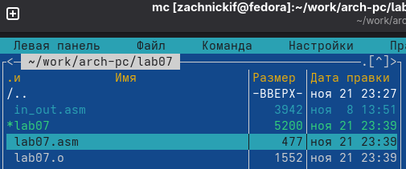{#fig-001 width=70%}

{#fig-002 width=70%}

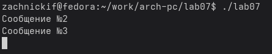{#fig-003 width=70%}

Таким образом, использование инструкции jmp _label2 меняет порядок исполнения
инструкций и позволяет выполнить инструкции начиная с метки _label2, пропустив вывод
первого сообщения.

Далее изменим код программы согласно листингу 7.2 и заново соберем файл.

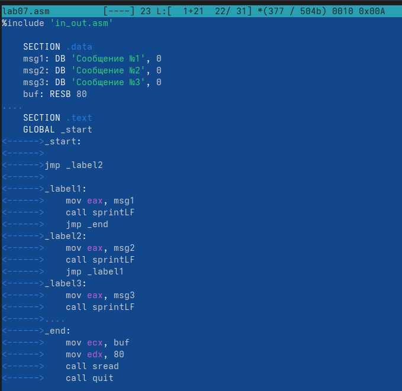{#fig-004 width=70%}

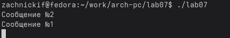{#fig-005 width=70%}

На выход мы получаем вывод сначала второго, а потом первого сообщения.

Теперь изменим код, чтобы выводило сообщения с 3-го по 1-е.

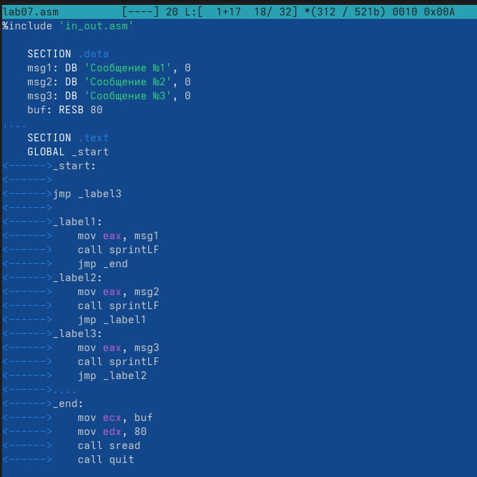{#fig-006 width=70%}

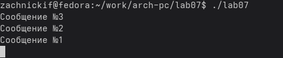{#fig-007 width=70%}

Задание выполнено успешно.

Теперь создадим файл *lab7-2.asm* и запишем в него код из листинга 7.3, а потом соберем файл

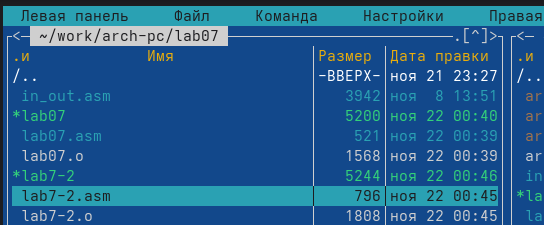{#fig-008 width=70%}

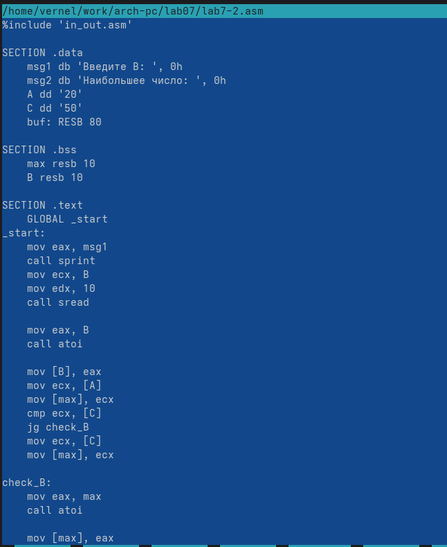{#fig-009 width=70%}

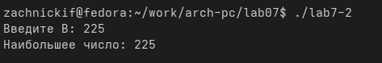{#fig-010 width=70%}

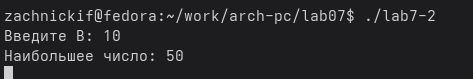{#fig-011 width=70%}

Программа работает корректно и исправно находит наибольшее.

## **Изучение структуры файлы листинга**

Создадим файл листинга из *lab7-2.asm* с помощью команды *nasm -f elf -l lab7-2.lst lab7-2.asm*

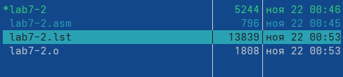{#fig-012 width=70%}

Теперь выберем три строки, а именно с 49-й по 51-ю, и объясним их. 

{#fig-013 width=70%}

В начале каждой строки идёт ее номер, а потом адрес. Например, адрес строки 49 это *00000032*, т.е адрес инструкции *push eax* в сегменте *.text.* Она кодируется одним байтом, поэтому за ней идет адрес *00000033*, но потом идет инструкция *mov eax*, которая занимает уже 5 байт, поэтому адрес следующего *push eax* уже *00000038*. После адреса идут наши инструкции в виде машинного кода. Сами же команды значат то, что им нужно сделать. Например, *push eax* кладет текущее значение регистра eax в стек, после нее *mov eax* загружает значение 0Ah, которое является символом перевода строки, в конце еще одна *push eax* кладет в стек загруженное значение 0Ah.

Теперь в коде найдем инструкцию с двумя операндами, например, *mov ecx, B* и уберем *B*. 

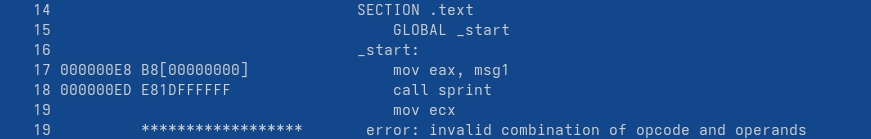{#fig-014 width=70%}

В таком виде эта инструкция бессмысленна, так как операнда обязательно должно быть два. Листинг создается, но появляется строка об ошибке. 

# **Задание для самостоятельной работы**
1. Создаем файл *practice1.asm*. Используя в качестве примера код из листинга 7.2, видоизменяем его и немного меняем логику, а также избавляемся от необходимости перевода из строки в число, записав А и С сразу в качестве числа. Собираем файл и проверяем работу с данными из варианта 1.

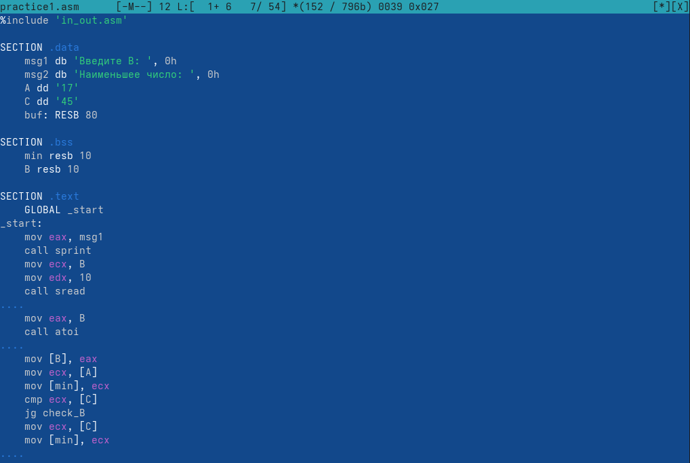{#fig-015 width=70%}

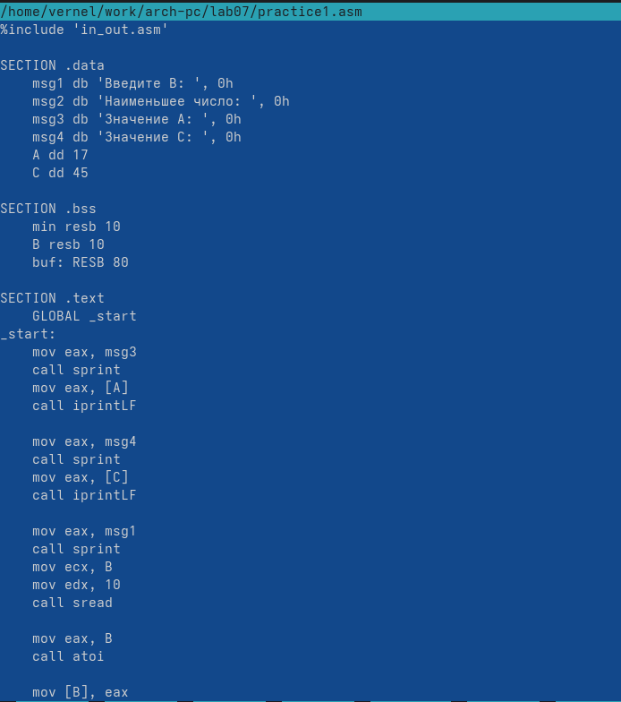{#fig-016 width=70%}

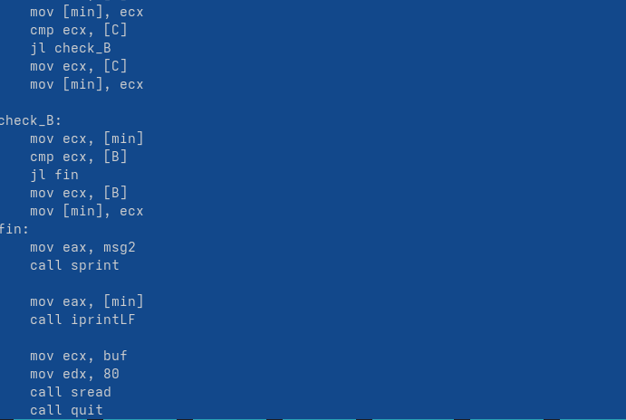{#fig-017 width=70%}

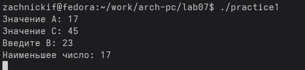{#fig-018 width=70%}

Программа работает корректно, задание успешно выполнено.

2. Создаем файл *practice2.asm*. Пишем в нем код, который будет запрашивать два значения, а потом согласно заданной функции из варианта 1 выдавать ответ. Соберем файл и проверим корректность работы используя данные из варианта 1. 

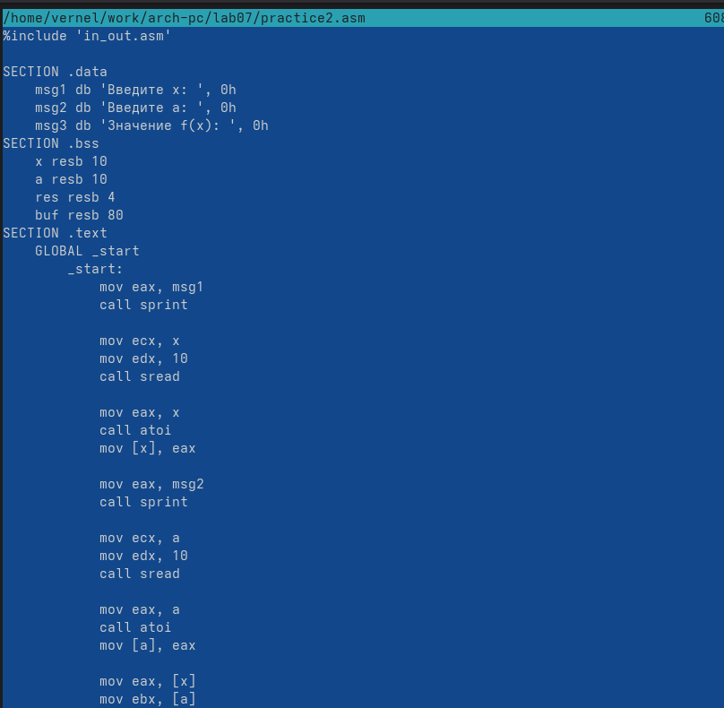{#fig-019 width=70%}

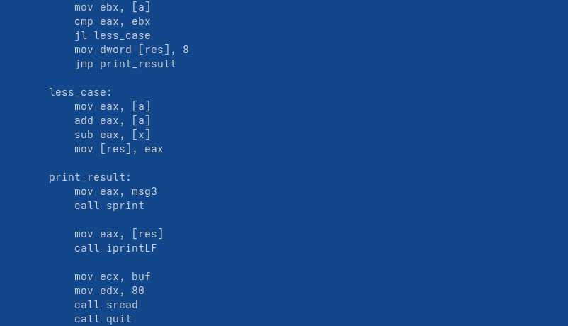{#fig-020 width=70%}

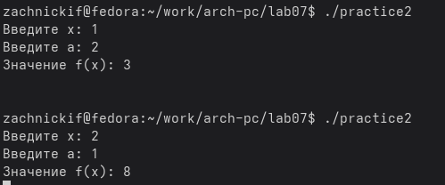{#fig-021 width=70%}

Программа работает корректно, проверив аналитически, я пришел к выводу, что и арифметически корректно тоже.

# **Выводы**

В ходе работы были были изучены команды условного и безусловного переходов, а также приобретены навыки написания программ с использованием переходов. Знакомство с назначением и структурой файлов листинга прошло успешно.

::: {#refs}
:::
