---
author:
  name: Никифоров Захар Сергеевич
  group: НКАбд-05-25
  student-id: 1032253520
title: "Отчет по лабораторной работе №8"
subtitle: "Архитектура компьютера"
license: "CC BY"
---

# **Цель работы**

Приобретение навыков написания программ с использованием циклов и обработкой
аргументов командной строки.

# **Порядок выполнения работы**
## **Реализация циклов в NASM**

Создаем каталог *lab08*, а в нем создаем файл *lab8-1.asm*, записываем код из *Листинг 8.1* и компилируем его.

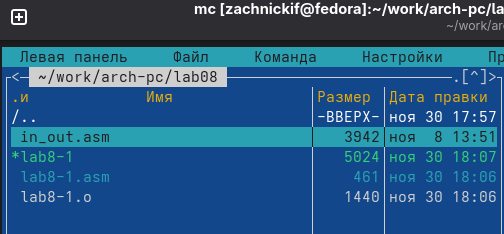{#fig-001 width=70%}

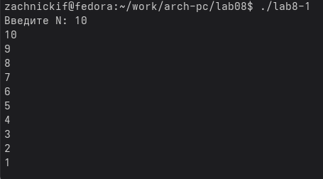{#fig-002 width=70%}

Получаем вывод итераций цикла от 10 до 1. Теперь внесем изменения значения регистра *ecx* в цикле.

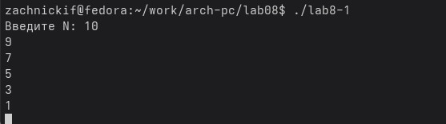{#fig-003 width=70%}

Мы видим, что количество итераций стало некорректным. Оно сократилось вдвое. Снова внесем изменения, добавив команды push и pop (добавления в стек и извлечения из стека) для сохранения значения счетчика цикла loop.

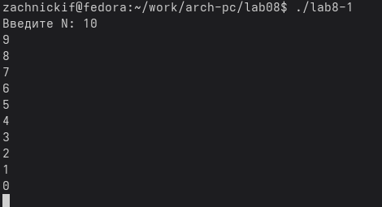{#fig-004 width=70%}

Теперь программа работает более корректно и количество итераций равно числу, введенному с клавиатуры.

## **Обработка аргументов командной строки**

Создадим файл *lab8-2.asm*, запишем в него текст из *Листинг 8.2*, скомпилируем и запустим, вписав перед этим три аргумента: аргумент1, аргумент2, 'аргумент3'

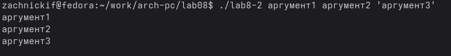{#fig-005 width=70%}

Программа обработала и вывела все три аргумента. Теперь создадим новый файл *lab8-3.asm*, запишем в него текст из *Листинг 8.3*, скомпилируем и запустим с аргументами 12, 13, 7, 10, 5.

{#fig-006 width=70%}

Программа выводит результат от сложения этих чисел. Всё работает корректно. Теперь на основе этого перепишем код, чтобы программа выводила произведение.

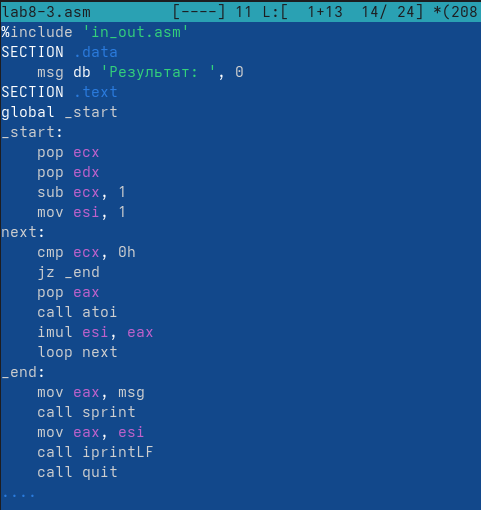{#fig-007 width=70%}

Я поменял значение *esi* на 1, так как, если будет 0, то резултат так и будет 0. Далее нужно заменить *add* на *imul*, чтобы мы получали произведение, а не сумму.

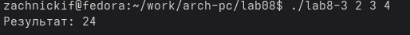{#fig-008 width=70%}

Получаем корректный результат. 

# **Задание для самостоятельной работы**
1. Создаем файл *self.asm*. Используя в качестве примера код из листинга 8.3, пишем логику, чтобы получить необходимый результат.

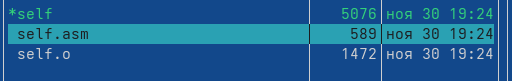{#fig-009 width=70%}

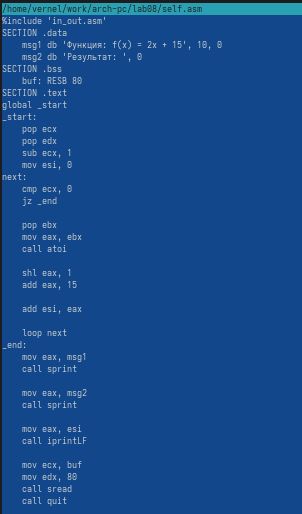{#fig-010 width=70%}

Теперь проверим корректность работы с помощью трёх троек -- (2,3,4), (3,4,5), (4,5,6)

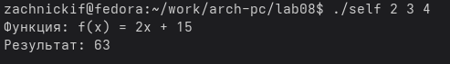{#fig-011 width=70%}

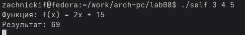{#fig-012 width=70%}

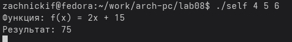{#fig-013 width=70%}

Проверив аналитически, убеждаемся, что вывод корректный, а значит задание выполнено.

# **Выводы**

В ходе работы были были приобретены навыки написания программ с использованием циклов и обработкой аргументов командной строки.

::: {#refs}
:::
