---
author:
  name: Никифоров Захар Сергеевич
  group: НКАбд-05-25
  student-id: 1032253520
title: "Отчет по лабораторной работе №9"
subtitle: "Архитектура компьютера"
license: "CC BY"
---

# **Цель работы**

Приобретение навыков написания программ с использованием подпрограмм. Знакомство
с методами отладки при помощи GDB и его основными возможностями.

# **Порядок выполнения работы**
## **Реализация подпрограмм в NASM**

Создаем каталог *lab09*, а в нем создаем файл *lab9-1.asm*, записываем код из *Листинг 8.1* и компилируем его.

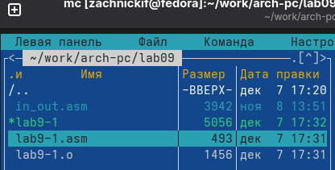{#fig-001 width=70%}

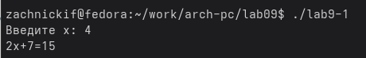{#fig-002 width=70%}

Получаем вывод результата функции. Запишем в код подпрограмму *_subcalcul*, вычисляющую f(g(x)), снова соберем и проверим вывод.

{#fig-003 width=70%}

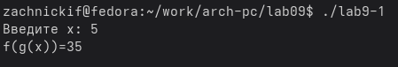{#fig-004 width=70%}

Мы видим, что программа работает корректно.

## **Отладка программам с помощью GDB**

Создадим файл *lab9-2.asm*, запишем в него текст из *Листинг 9.2*, скомпилируем с получением файла трансляции и запустим в gdb.

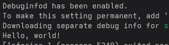{#fig-005 width=70%}

Программа работает, как надо, перейдем к её анализу. Поставим брейкпоинт на старте программы.

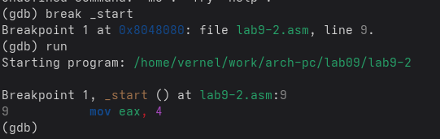{#fig-006 width=70%}

Посмотрим на диассимилированный код в двух синтаксисах.

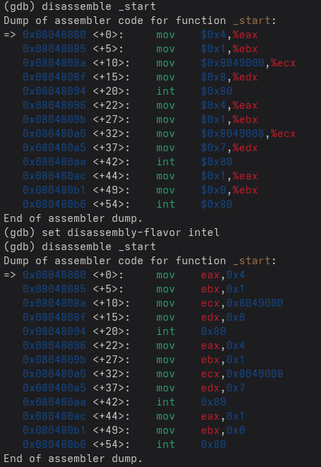{#fig-007 width=70%}

Мы можем заметить разницу в отображении операндов инструкций в разных синтаксисах. 

## **Добавление точек останова**

Посмотрим на вид в псевдографике и список брейкпоинтов.

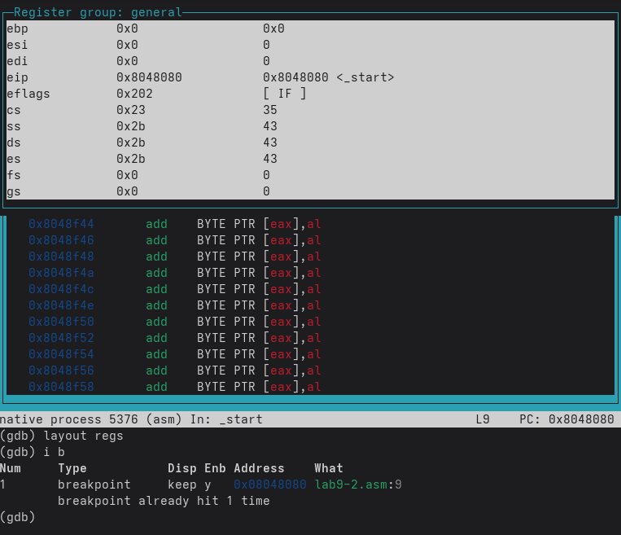{#fig-008 width=70%}

Установим новый брейпоинт по адресу.

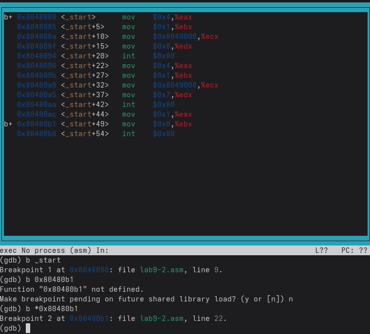{#fig-009 width=70%}

## **Работа с данными программы в GDB**

Посмотрим содержимое регистров

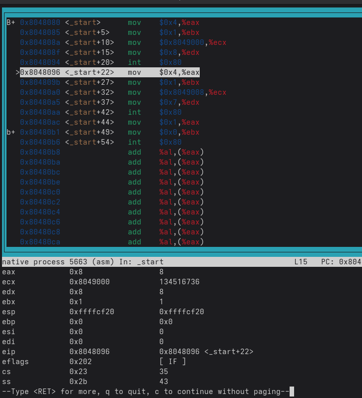{#fig-010 width=70%}

Теперь посмотрим содержание переменных *msg1* и *msg2* по их адрессам. 

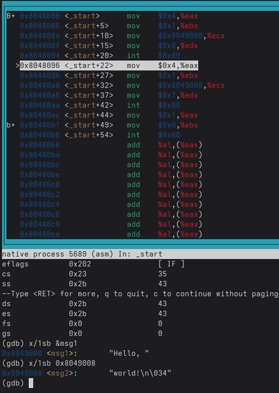{#fig-011 width=70%}

П   опробуем поменять символ в *msg2*. 'w' на 'W'.

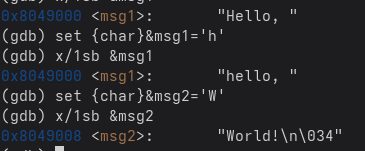{#fig-012 width=70%}

Разница вывода команд *p/s $ebx* связана с тем, что сначала мы присвоили '2', который имеет значение 50 в ASII коде, а потом число 2, которому соответсвует 2.

## **Обработка аргументов командной строки в GDB**

Копируем файл *lab8-2.asm* с новым именем *lab9-3.asm*, компилируем и запускаем его с gdb.

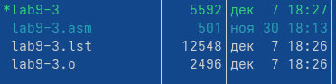{#fig-013 width=70%}

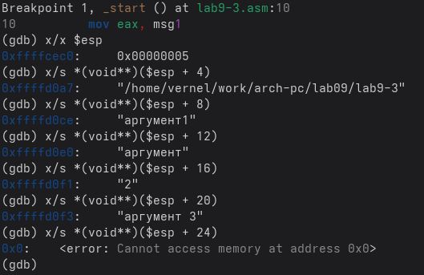{#fig-014 width=70%}

Адрес аргументов увеличивается с шагом 4, так как каждый указатель занимает 4 байта.

# **Задание для самостоятельной работы**
1. Копируем файл *self.asm* из прошлой лабораторной, записав вычисление функции в виде подпрограммы *_calc*, компилируем и запускаем.

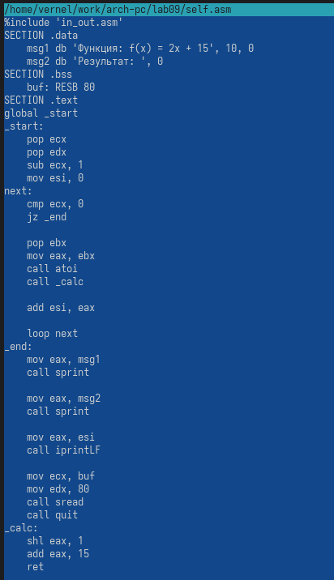{#fig-015 width=70%}

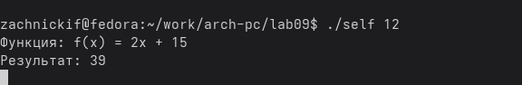{#fig-016 width=70%}

Программа работает корректно

2. В программе допущена ошибка, когда передаем в mul ecx, мы умножаем не ebx на 4, а ecx на 4, получаем 8, которая после не задействуется, поэтому выходит, что ebx+ebx=5+5=10, а не 25. Исправим программу.

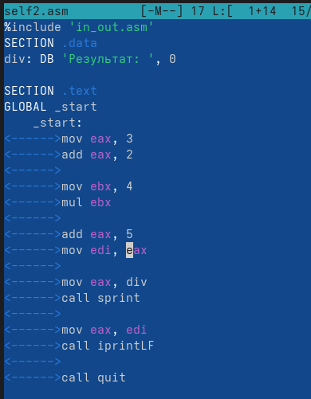{#fig-017 width=70%}

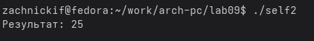{#fig-018 width=70%}

Теперь программа работает корректно.

# **Выводы**

Были приобретены навыки написания программ с использованием подпрограмм. Познакомились
с методами отладки при помощи GDB и его основными возможностями.

::: {#refs}
:::
