---
author:
  name: Никифоров Захар Сергеевич
  group: НКАбд-05-25
  student-id: 1032253520
title: "Отчет по лабораторной работе №10"
subtitle: "Архитектура компьютера"
license: "CC BY"
---

# **Цель работы**

Приобретение навыков написания программ для работы с файлами.

# **Порядок выполнения работы**

Создаем каталог *lab10*, а в нем создаем файл *lab10-1.asm*, записываем код из *Листинг 10.1* и компилируем его.

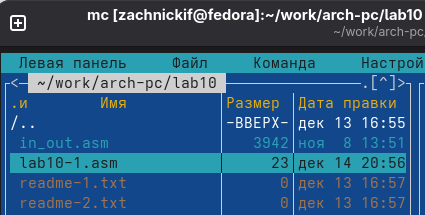{#fig-001 width=70%}

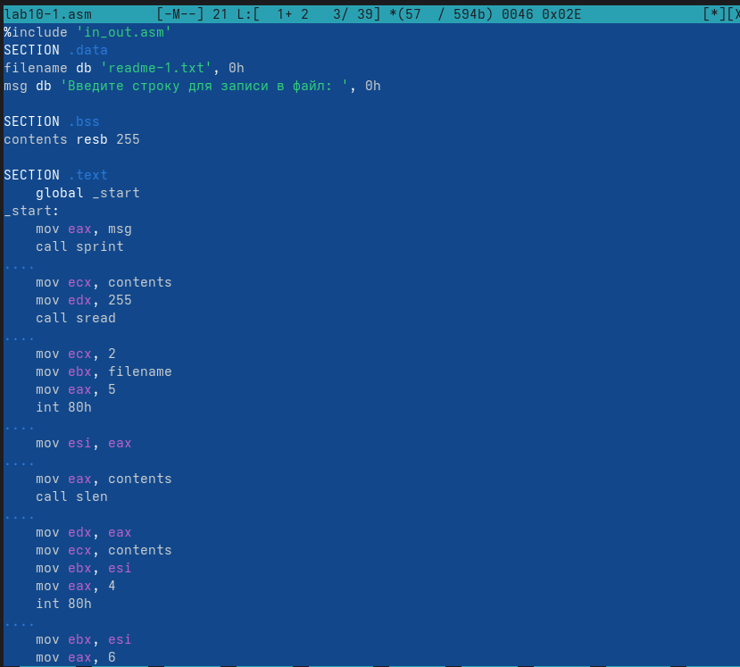{#fig-002 width=70%}

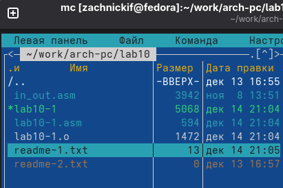{#fig-003 width=70%}

Проверим программу, вписав 'Hello world!'.

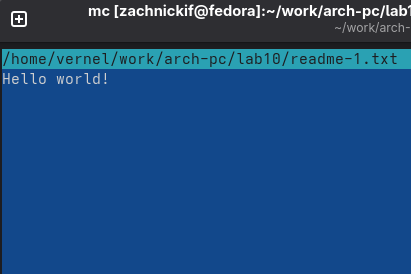{#fig-004 width=70%}

Мы видим, что программа работает корректно.

Теперь с помощью команды *chmod* изменим права доступа у исполняемого файла, убрав доступ у владельца для исполнения файла.

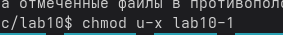{#fig-005 width=70%}

Проверим права с помощью команды *ls -l lab10-1*.

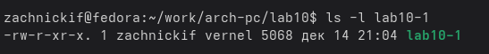{#fig-006 width=70%}

Права успешно изменены, попробуем открыть файл.

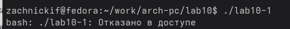{#fig-007 width=70%}

Отказано в доступе, как и должно быть, так как мы убрали права на исполнение.

Теперь поменяем права у файла с расширением '.asm', предварительно посмотрев на исходные.

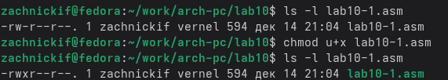{#fig-008 width=70%}

Прав на исполнение файла не было, так как файл неисполняемый, ему они и не нужны. Попробуем открыть его, а потом исполняемый файл

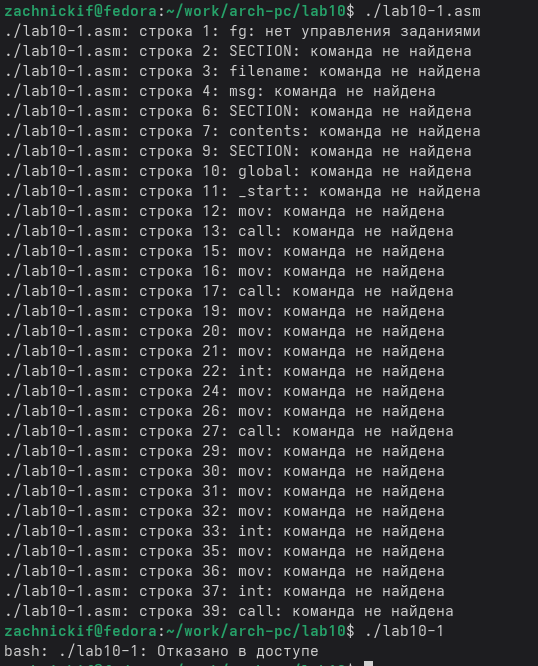{#fig-009 width=70%}

Как и ожидалось, bash негодует. Файлы типа '.asm' не являются исполняемыми, поэтому так и выходит. Изменения в правах исходного файла не повлияли на исполняемый файл.

Теперь поменяем расширения файлам *readme-1.txt* и *readme-2.txt* в соответствии с указаниями в *Таблице 10.4* для первого варианта.

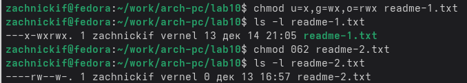{#fig-010 width=70%}

Изменение прав прошло успешно. 000 110 010 это 064 если посимвольно интерпретировать двоичный код в десятеричную систему.

# **Задание для самостоятельной работы**
1. Создадим файл *practice.asm* и, взяв за основу код из *Листинг 10.1*, напишем программу согласно требованиям, скомпилируем её и попробуем записать своё имя.

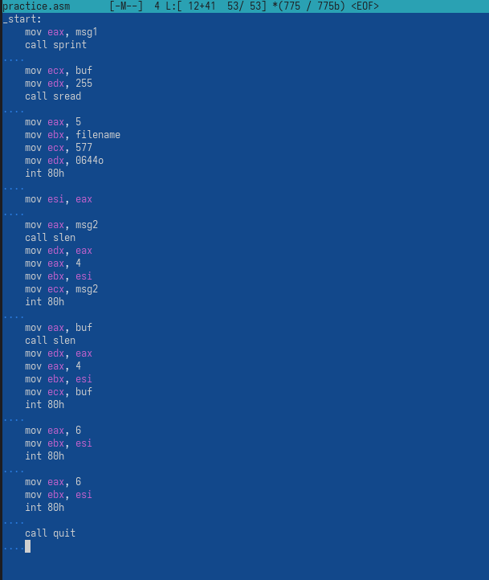{#fig-011 width=70%}

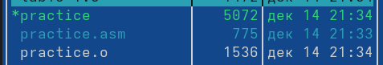{#fig-012 width=70%}

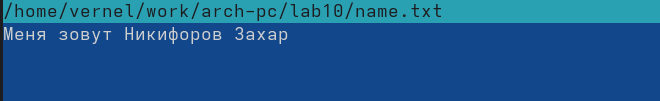{#fig-012 width=70%}

Программа успешно выполняется, задание сделано.

# **Выводы**

Были приобретение навыки написания программ для работы с файлами.

::: {#refs}
:::
